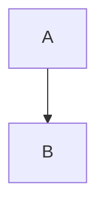

# MD Viewer

Browses Markdown files from any folder on your machine in read-only mode,
with a left-side menu to navigate between them (including subfolders).

Run:

```
node server.js
```

Then open http://localhost:4739

By default it shows the bundled `sample-docs/` folder. Enter a different
folder path in the sidebar's text box and click "Set" to browse it instead —
the choice is remembered (stored in `data.db`) across restarts.

Nothing is ever written back to the files you browse; the app only reads
`.md` files under the selected folder.

Fenced code blocks labeled `mermaid` are rendered as diagrams (via a
locally-vendored copy of [Mermaid](https://mermaid.js.org/), no network
access required):

````

````
